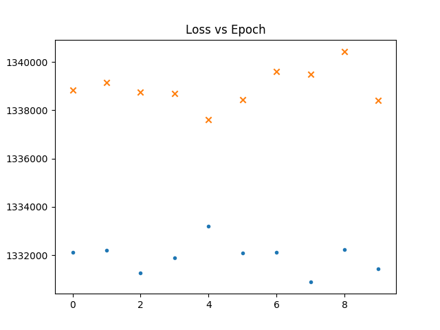
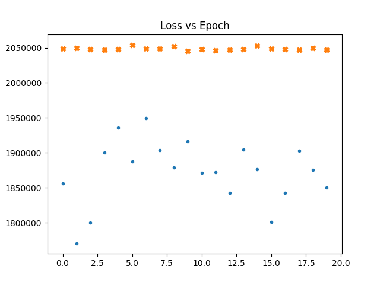
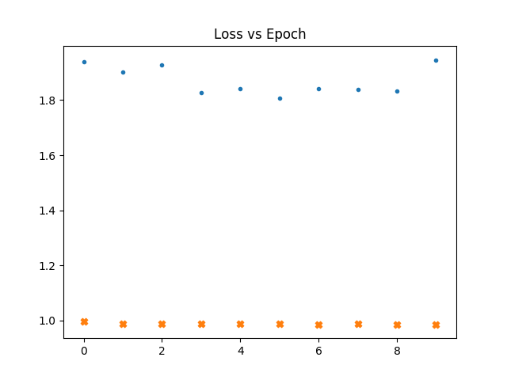

# Details
With NSIDE = 32 the number of pixels is 12288. 
Using 3 Convnet layers with 32,16 and 8 filters respectively,I 
reduce the number of pixels to 48, then do a fully connected layer to 36. I decode it back the same way.

In the following graphs  a dot represents the loss vs epochs for
the gaussian maps. a cross for fnl = 1e-4. Thicker cross for fnl = 1e-3.

## Loss for fnl = 1e-4 compared to gaussian

## Loss for fnl = 1e-3 compared to gaussian and fnl=1e-4

## Loss for fnl = 1e-3 compared to gaussian after normalizing
In the following plot the gaussian maps were generated after 
calculating the power spectra of the non-gaussian maps, So that we
can make sure that the maps have the same power spectra

## Training with non gaussian maps
We see that even if we train with non gaussain maps. The loss doesn't go down.

### Normalized with mean

### Normalized with Standard deviation

What is interesting is that though the network never seems to
learn the loss is already high for non gaussian maps.

Maybe gaussian random initialization has something to do with it.

# TO-DO
 - I need maps gaussian with different power spectra to test this incease in loss with non gaussianities further.

 - (More important) As of now, I am blindly reshaping the map
array healpy gives me into a rectangle. I feel like spatial information is lost that way. I need a way to project it into a map and 
then get the two dimensional pixel data as an array.
